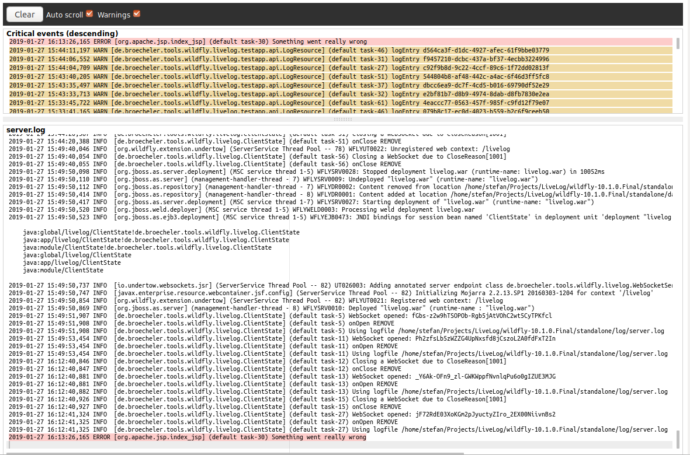

# About livelog

Wildfly-livelog is a simple browser-based quasi-realtime logfile viewer for the [wildfly](http://wildfly.org/) application server.
It is intended for use in development environments where direct access to the logfile is not possible e.g. when
running wildfly in a docker container. 

Based on a simple to deploy java web application the contents of the `server.log` file  are streamed to a modern webbrowser via a websocket.
Syntax highlighting and clickable links make it easy to spot errors and warnings in the log output.

Wildfly-livelog assumes a standard logging configuration of wildfly. It is not intented for viewing huge log files or
for use in production systems.




# Build and usage

Use the [binaries](releases) supplied with the releases or compile the project

```
mvn clean install
```

Deploy the web application to a locally running wildfly installation by running the deployer jar from a terminal:

```
java -jar deployer/target/wildfly-livelog-deployer.jar
```

The deployer includes the web application's WAR file and deploys it to a local wildfly via the management interface. Once the deployment is complete, 
it will automatically open the web application (http://localhost:8080/livelog) in the 
default web browser. 

For deploying to a remote server supply its connection paramters via command line arguments, e.g.
```
java -jar deployer/target/wildfly-livelog-deployer.jar --user wildfly --password test123 --server myserver --port 9990 --protocol http-remoting
```

If you do not want to use the deployer application you can also simply deploy the WAR from `webapp/target/livelog.war` to wildfly and point your
web browser to it. 

# Supported versions

Livelog was developed and tested with Firefox 63.0, Chrome 70 and Wildfly 10.1. 

# Running the selenium tests

For running the selenium tests with firefox the geckodriver binary must be copied to `test/lib/seleniumdrivers/`.

Then deploy the test application's WAR to a locally running wildfly instance:
```
cd test/
mvn clean install -PdeployTestapp
```
Now the tests can be run as follows
```
mvn verify -Pe2eTests
```
# Licenses

Livelog is published under the MIT license, for details see the [LICENSE.txt](LICENSE.txt) file.

Livelog uses a number of third party modules listed in the [THIRD-PARTY.txt](THIRD-PARTY.txt) and [THIRD-PARTY-WEB.txt](THIRD-PARTY-WEB.txt) files. 


